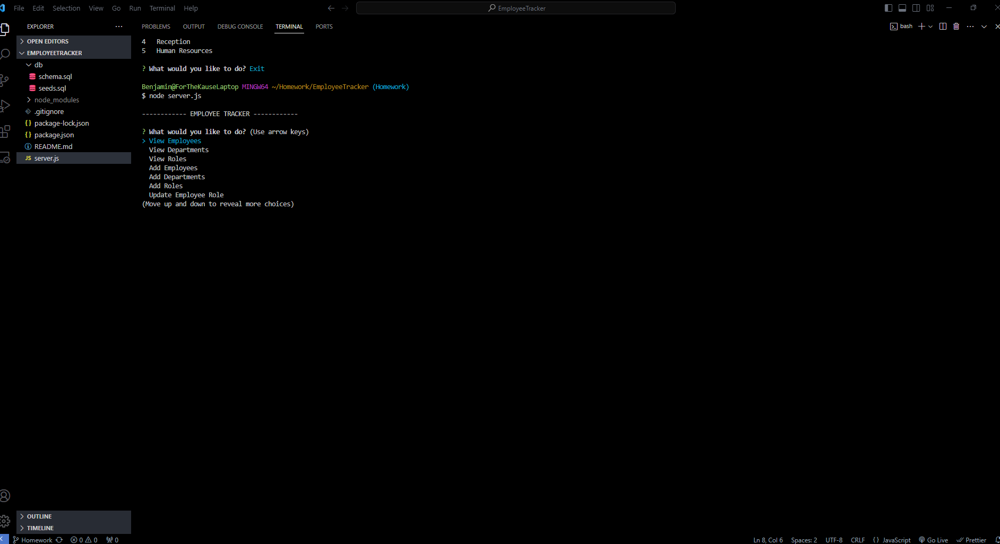
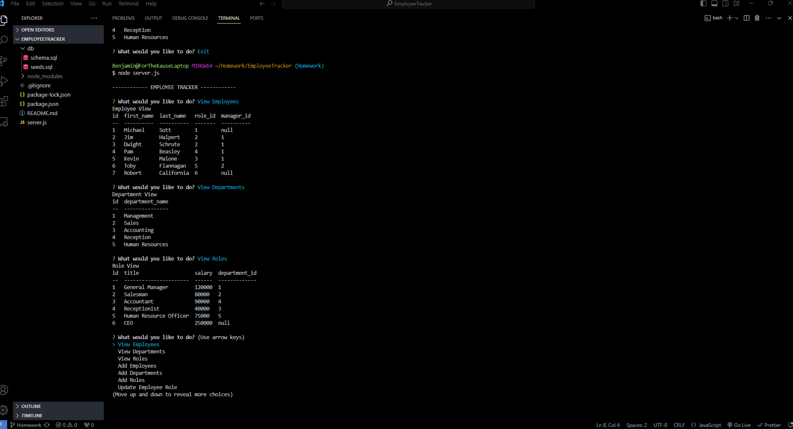

# Table of Contents
- [Project Name](#project-name)
- [Description](#description)
- [Installation](#installation)
- [Usage](#usage)
- [Features](#features)
- [Contributing](#contributing)
- [License](#license)
- [Tests](#tests)
- [Questions](#questions)
- [Screenshots](#screenshots)
## Project Name
${Employee-Tracker}
## Description
${description}
i simple appliction and databse to track employees for a company.
## Installation
${installation}
Download git repository, ensure you have proper dependencies as followed.
inquirer
mysql2
console.table
## Usage
${usage}
to start application run node tracker.js to view data log into mysql and view the database
## Features
${features}
create department,role,salary
## Contributing
${contributing}

## License
[Mit License](https://choosealicense.com/licenses/mit/#)
## Tests
${tests}
## Questions
- [bjpippenger](https://github.com/Bjpippenger/EmployeeTracker)
- [send-email-to](bjpippenger@yahoo.com)
- [recording-of-working-application]()
## Screenshots
${screenshots}

Choose a LicenseChoose a License
MIT License
A short and simple permissive license with conditions only requiring preservation of copyright and license notices. Licensed works, modifications, and larger works may be distributed under different terms and without source code.